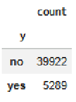
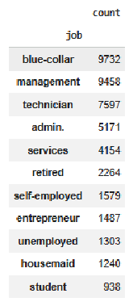
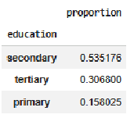
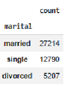
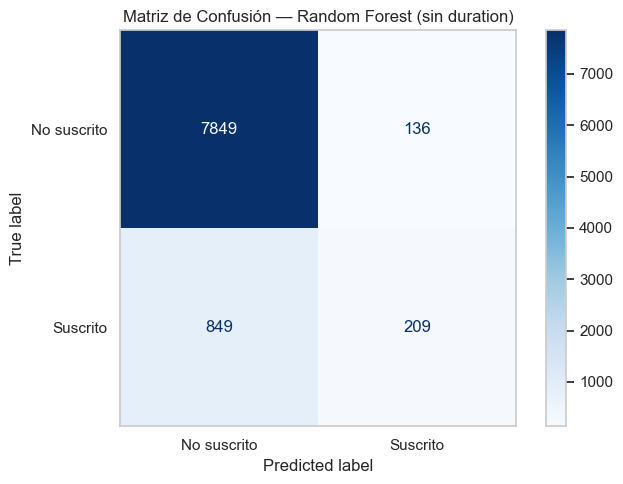
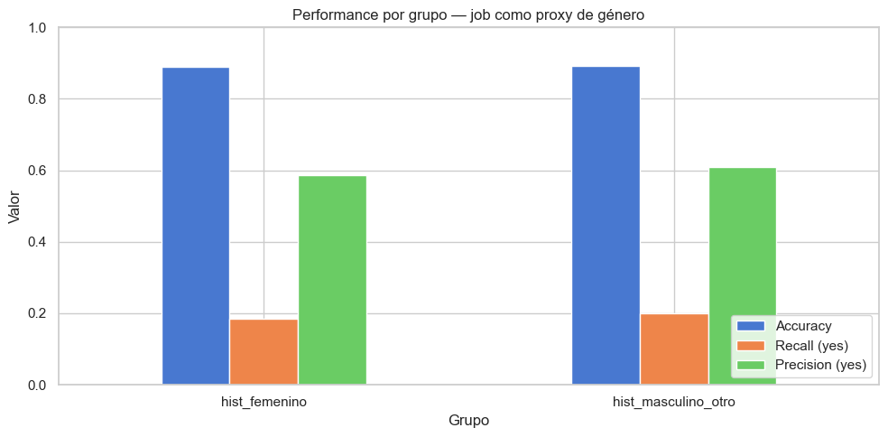
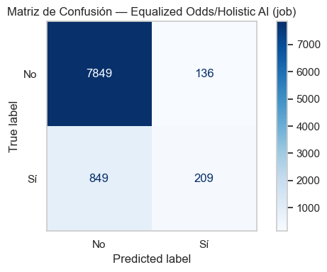
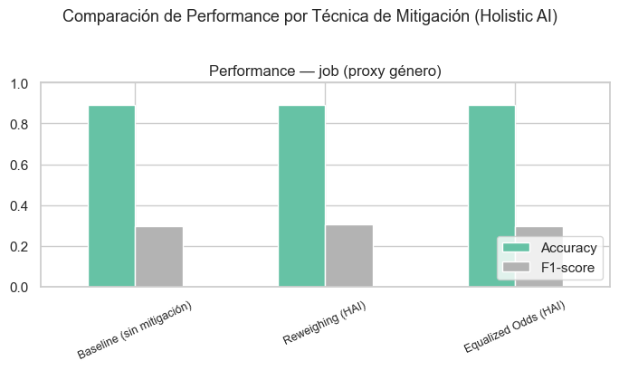
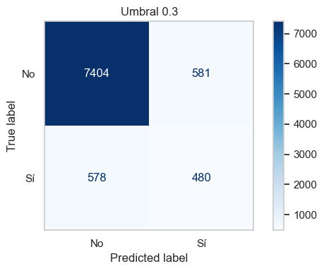

# Informe Final: Equidad en Aprendizaje Automático
**Trabajo Práctico Integrador**
**Conjunto de Datos:** Bank Marketing
**Integrantes:** Tomás Nadal, Alejandro Echeverri, Matías Bacalhau, Rocío Rivera

---

## 1. Introducción y Marco del Conjunto de Datos (Ejercicio 1)

En este proyecto, nosotros abordamos de manera exhaustiva el análisis de equidad algorítmica y la construcción de modelos predictivos aplicados al conjunto de datos Bank Marketing Dataset. Dicho conjunto, ampliamente reconocido en la comunidad académica, proviene del repositorio de *Machine Learning* de la Universidad de California en Irvine (Moro, Cortez, & Rita, 2014). Para fundamentar teóricamente todas nuestras decisiones, decidimos apoyarnos directamente en los trabajos de los autores originales y los conceptos abordados en el presente curso.

### 1.1 Datasheets for Datasets y Contexto Histórico
Siguiendo las metodologías rigurosas de documentación que proponen Gebru et al. (2021) en su famoso trabajo *Datasheets for Datasets*, nosotros diseccionamos el origen y la estructura de nuestros datos para comprender el contexto sociotécnico antes de entrenar cualquier modelo:

*   **Motivación Original:** Tal como lo describen Moro, Cortez y Rita (2014) en su investigación sobre telemarketing, nosotros comprendemos que este conjunto fue creado para demostrar la eficacia de la Minería de Datos (*Data Mining*) en la priorización de clientes bancarios portugueses. Nuestro objetivo predictivo es anticipar si un cliente suscribirá a un depósito a plazo fijo, reduciendo así la enorme cantidad de llamadas infructuosas (usualmente a todos los clientes de la base) y optimizando el tiempo de los operadores telefónicos.
*   **Composición:** Observamos que el dataset no presenta una estructura relacional compleja. Cada instancia consolida el perfil demográfico, el contexto de la interacción y las variables macroeconómicas correspondientes a una sola llamada telefónica ocurrida 2008  2010.
*   **Proceso de Recopilación y Preprocesamiento:** Se trata de datos adquiridos a través de un proceso híbrido: por un lado, observaciones directas de registros administrativos de la institución (resultados de llamadas) y por otro, indicadores socioeconómicos derivados de fuentes externas como el Banco Central Europeo. Durante la limpieza de los datos, tomamos una decisión muy importante para el éxito de la simulación real del trabajo: **decidimos excluir la variable `duration` (duración de la llamada)** por dos razones. La primera es relativa al problema de *Data Leakage* (Fuga de Datos): nosotros no podemos saber cuánto durará una llamada hasta que ésta termina, momento en el cual el cliente ya nos dio su respuesta; la segunda es que duration puede estar fuertemente correlacionada con nuestro objetivo, dado que una llamada larga implica interes de parte del cliente. Por estos dos motivos, decidimos que entrenar el modelo con esta ventaja anulaba por completo su utilidad en un escenario predictivo pre-llamada.
*   **Usos Conocidos:** Identificamos que este conjunto se ha utilizado históricamente para demostrar cómo enfocar campañas de marketing predictivo reduciendo el número de llamadas (llamando al ~10% de clientes con mayor probabilidad se captura el 50% de los depósitos) y como base para pruebas de técnicas de balanceo sintético como SMOTE.

### 1.2 Entorno Computacional y Reproducibilidad
Para garantizar la transparencia y la auditabilidad exigida en experimentaciones de *Machine Learning*, nosotros desarrollamos el proyecto utilizando un entorno Python 3.13, apoyándonos en librerías estables como `scikit-learn` para el entrenamiento algorítmico y `pandas` para el manejo de estructuras de datos. Para el análisis avanzado de sesgos empleamos la versión más reciente de la librería `holisticai`. Todo el código fuente y los cuadernos de experimentación fueron controlados y versionados rigurosamente mediante Git en un repositorio colaborativo. Adicionalmente, para garantizar una reproducibilidad del 100% en las particiones de entrenamiento y prueba (*train/test split*), así como en el comportamiento de los ensambles estocásticos, nosotros fijamos globalmente la semilla de aleatoriedad (`random_state`) en todos nuestros algoritmos.

## 2. Análisis Exploratorio y Detección Temprana de Sesgos

Durante nuestra primera exploración de los datos, identificamos y graficamos diversos obstáculos relativos a fairness.


**Figura 1:** Gráfico de distribución del desbalance de la variable objetivo 'y'. Se observa claramente que la enorme mayoría de las llamadas resultaron en un rechazo a suscribir el depósito.

Como podemos observar en la Figura 1, descubrimos un **fuerte desbalance de clases**. Cerca del 90% de los contactos telefónicos resultaron en rechazo. Este nivel de desequilibrio nos indica que, si no penalizábamos a nuestros algoritmos o ajustábamos nuestros umbrales, estos tenderían a especializarse en predecir exclusivamente el rechazo para minimizar el error global, ignorando a la pequeña minoría que sí desea suscribirse al plazo fijo.

### 2.1 La Búsqueda de un Proxy de Género

Debido a que el conjunto de datos carece de la variable género, decidimos adoptar el atributo categórico **`job` (ocupación)** como una variable *proxy* de género. 


**Figura 2:** Gráfico de distribución de clientes según su categoría laboral, utilizada como proxy de género. Muestra la concentración en oficios históricamente masculinizados y feminizados.

Al analizar las barras de la Figura 2, nosotros agrupamos las categorías histórica y culturalmente feminizadas (`housemaid` y `admin.`) en el segmento protegido que denominamos `hist_femenino` (representando un total de 1257 instancias), frente al resto de profesiones (tales como gerentes, obreros, técnicos) que agrupamos en `hist_masculino_otro` (con 7786 instancias).

### 2.2 Exploración de Variables Secundarias

Para tener una visión más global, nosotros también decidimos graficar y evaluar variables secundarias como la educación, el estado civil y la edad, ya que sospechábamos que allí también podrían esconderse sesgos estructurales de representación.

*   **El Sesgo por Edad (Variable Protegida Oficial):** Notamos un fenómeno llamado la *paradoja de la tasa base*. El grupo poblacional mayor (más de 65 años) está drásticamente subrepresentado en los datos de entrenamiento. Sin embargo, tienen la tasa de suscripción más alta (~27%). El modelo, al carecer de muestras, ignora esta alta probabilidad y arroja falsos negativos recurrentes para este grupo demográfico.


**Figura 3:** Gráfico de distribución de la variable nivel educativo. Expone la predominancia de clientes con nivel secundario completo.

En la Figura 3 notamos que la educación secundaria domina la muestra. Sin embargo, al cruzar estos datos con las tasas de conversión, vimos que los clientes con educación terciaria (universitarios) tenían mayor propensión porcentual a suscribirse, lo que podría hacer que el modelo priorice a este grupo privilegiado.


**Figura 4:** Gráfico de distribución de la variable estado civil. Indica una clara mayoría de clientes casados dentro de la base de datos.

De igual forma, en la Figura 4 encontramos que las personas casadas son mayoría (~60%) frente a solteros (~28%) y divorciados (~12%). Este análisis exploratorio nos demostró que las fuentes de sesgo basadas en desbalances de representación en la base de datos son variadas.

## 3. Modelo Predictivo y el Costo del Error (Ejercicio 2)

Antes de comenzar con el entrenamiento del modelo realizamos un pequeño preprocesamiento de los datos, aplicando *One-Hot Encoding* para convertir todas las variables categóricas nominales (como estado civil y ocupación) a representaciones numéricas, y estandarizamos las variables numéricas y financieras utilizando un `StandardScaler`. Esto último fue crítico para evitar que la inmensa magnitud de los saldos bancarios o los indicadores macroeconómicos dominaran distorsionadamente los cálculos del algoritmo.

Para la tarea central de clasificación, nosotros seleccionamos un modelo de **Random Forest** (Bosque Aleatorio) instanciado con hiperparámetros robustos (como `n_estimators=100` y el hiperparámetro correctivo `class_weight='balanced'`). Elegimos este ensamble de árboles de decisión porque nos brinda muchísima flexibilidad frente a las características mixtas y complejas de nuestro dataset. A pesar del esfuerzo de balanceo inicial, tras entrenar el modelo obtuvimos el siguiente reporte:

```text
=======================================================
              REPORTE DE CLASIFICACIÓN
=======================================================
              precision    recall  f1-score   support

          no       0.90      0.98      0.94      7985
         yes       0.61      0.20      0.30      1058

    accuracy                           0.89      9043
   macro avg       0.75      0.59      0.62      9043
weighted avg       0.87      0.89      0.87      9043
```

Adicionalmente, las Figuras 5 y 6 ilustran el comportamiento del modelo base y dan cuenta de las limitaciones a la hora de predecir la clase minoritaria:


**Figura 5:** Matriz de confusión y métricas del modelo Random Forest baseline. Muestra el alto desequilibrio de exactitud.


**Figura 6:** Curvas del modelo baseline, demostrando su bajo rendimiento en la clase positiva (clientes suscritos).

La métrica de exactitud global (*Accuracy*) alcanzó un **89%**. Sin embargo, nosotros sabíamos que esto era producto del desbalance. Por la misma razón, nuestro *Recall* (Sensibilidad) para la clase `yes` fue de apenas un **20%**. 
Es decir, nuestro modelo identificaba casi perfectamente a los que iban a rechazar (98%), pero pasaba por alto y perdía al 80% de los clientes que efectivamente se subscribieron (Falsos Negativos). 

### 3.1 Identificación y Justificación de nuestro Peor Error
Dado que los modelos no pueden ser optimizados para todas las métricas, y sabiendo que no todos errores cuestan lo mismo, determinamos que **el Falso Negativo (FN) es el error más costoso**, y por tanto el que queremos evitar. 

1. **Pérdida Comercial Irrecuperable:** Si nuestro modelo arroja un Falso Negativo, significa que predice "no interesado" cuando el cliente en realidad sí lo estaba. Si nosotros no lo llamamos, perdemos la captación del depósito a manos de otro banco competidor.
2. **Asimetría del Costo Operativo:** Equivocarnos arrojando un Falso Positivo solo significa que le hacemos una llamada inútil a alguien que terminará rechazando. El costo de esto es marginal (el salario por dos minutos del operador telefónico), aún más si lo comparamos con perder un inversor.

Dicho esto, llegamos a la conclusión de que cualquier política de equidad que aplicáramos debía enfocarse en equiparar los Verdaderos Positivos de los grupos identificados, es decir maximizar el *Recall* equitativamente.

## 4. Análisis de Equidad Algorítmica (Ejercicio 3)

Basándonos en la teoría dictada en clase y en textos complementarios, nosotros definimos **group fairness** para nuestro caso particular de la siguiente manera: 

*   **Statistical Parity (Paridad Estadística):** Requeriría que llamemos a la misma proporción de `hist_femenino` que de `hist_masc_otro`, independientemente de si realmente se iban a suscribir o no.
*   **Equal Opportunity (Igualdad de Oportunidades - TPR):** Exige que, *exclusivamente entre los clientes que nosotros sabemos que sí se iban a suscribir*, nuestro modelo los encuentre con la misma eficacia estadística (Tasa de Verdaderos Positivos) sin importar si ocupan empleos feminizados o no. 
*   **Equalized Odds (Igualdad de Probabilidades):** Exige que igualemos tanto nuestra Tasa de Verdaderos Positivos (TPR) como nuestra Tasa de Falsos Positivos (FPR) a través de todos los grupos.
*   **Predictive Parity (Paridad Predictiva):** Exige que la confiabilidad (Precisión) de nuestras predicciones positivas sea igual para ambos grupos.

Teniendo en cuenta un teorema fundamental de la equidad en Machine Learning (Chouldechova, 2017; Kleinberg, Mullainathan, & Raghavan, 2016): cuando las tasas base (la proporción real de clientes que suscriben) difieren entre grupos, **es matemáticamente imposible satisfacer simultáneamente todos los criterios de equidad**, nos vimos obligados a adoptar una: **Equal Opportunity (TPR)**. Dado que queremos minimizar los Falsos Negativos, esta métrica nos garantiza la calidad del modelo, es decir que ofrecemos el mismo servicio (la venta de plazos fijos) tanto a las personas cuya ocupaciones son historicamente femenizadas como a las demás.

Al medir esto sobre nuestro Random Forest inicial con una tolerancia del 10% (umbral de disparidad del 0.1), **nos sorprendimos al descubrir que nuestro modelo ya era equitativo (*Fair*)**. 

```text
--- Métricas de Fairness por Grupo (job) ---
                     Statistical Parity  Equal Opportunity (TPR)  Predictive Parity (Precision)  TPR (Equalized Odds)  FPR (Equalized Odds)
Grupo                                                                                                                                      
hist_femenino                  0.036595                 0.184932                       0.586957              0.184932              0.017102
hist_masculino_otro            0.038402                 0.199561                       0.608696              0.199561              0.017021

--- Disparidades (umbral = 0.1) ---
Statistical Parity: 0.0018 → ✅ FAIR
Equal Opportunity (TPR): 0.0146 → ✅ FAIR
Predictive Parity (Precision): 0.0217 → ✅ FAIR
TPR (Equalized Odds): 0.0146 → ✅ FAIR
FPR (Equalized Odds): 0.0001 → ✅ FAIR
```

Para apoyar numéricamente estos hallazgos, la Figura 7 ilustra de forma visual las métricas de equidad evaluadas para los subgrupos de la variable protegida:


**Figura 7:** Métricas de equidad por grupo ocupacional (proxy de género), mostrando una leve disparidad estadística aceptable.

La brecha de nuestro modelo fue de apenas un 1.46% (0.0146). La Tasa de Verdaderos Positivos para los trabajos feminizados fue del 18.49% y para el resto del 20.50%. Si bien esto demuestra matemáticamente que nuestro Random Forest en su forma nativa no ejerce una discriminación algorítmica severa, nos obliga a mantener una postura analítica crítica frente a tres posibles escenarios subyacentes: 
1. El modelo original y los datos de este banco realmente carecen de un sesgo histórico de género respecto a la adquisición de plazos fijos.
2. El sesgo de género existe en la sociedad, pero no es un factor que afecte significativamente la propensión de ahorro en este producto financiero en particular.
3. La variable **`job`** resulta ser un proxy inferencial demasiado débil para capturar la verdadera complejidad de la brecha de género (hipótesis respaldada tras aislar posteriormente solo la categoría `housemaid`, donde la disparidad algorítmica se mantuvo en un ínfimo 0.006).

## 5. Técnicas de Mitigación de Sesgos (Ejercicio 4)

A pesar de que descubrimos que nuestro modelo era éticamente equitativo, nosotros seguíamos teniendo el gran desafío de negocio: necesitábamos levantar ese paupérrimo 20% de Recall global. Por lo tanto, nos pusimos a programar diversas técnicas mitigadoras utilizando la librería profesional *Holistic AI*.

### 5.1 Reweighing (Pre-procesamiento)
Nosotros aplicamos *Reweighing* para inyectar ponderaciones en los datos de entrenamiento. Esta técnica calcula los pesos de manera inversamente proporcional a la frecuencia de las clases, buscando balancear la representación. Curiosamente, encontramos que este enfoque falló para nuestros propósitos de negocio. Si bien nos subió imperceptiblemente la Exactitud global a 0.8937, notamos que el modelo sacrificó la Tasa de Verdaderos Positivos (TPR) del grupo `hist_femenino` (cayendo de 0.1849 a 0.1575). Decidimos que esto no era aceptable dado que profundizaba nuestro problema.

Para ilustrar los resultados tras la aplicación de esta técnica, adjuntamos la Figura 8 generada por la librería *Holistic AI*:


**Figura 8:** Resultados de métricas de equidad tras aplicar la técnica de Reweighing. Se nota una desmejora contraproducente en el grupo femenino.

### 5.2 Equalized Odds (Post-procesamiento)
También utilizamos el mitigador *post-hoc* de *Holistic AI*, el cual aplica algoritmos de programación lineal para forzar y ajustar las probabilidades predictivas finales (igualando el TPR y el FPR forzosamente). Al aplicarlo sobre nuestro modelo que ya tenía apenas un 2% de disparidad, constatamos que el optimizador matemático directamente no produjo mejoras. Lo cual tiene sentido: el modelo tenía un margen de mejora despreciable. Esto nos dice que aplicar librerías matemáticamente complejas a ciegas sobre un modelo no implica que mejorará, es decir aumentar equitativamente el Recall.

A continuación, la Figura 9 expone el reporte visual de *Holistic AI* con las métricas post-procesamiento:


**Figura 9:** Resultados tras aplicar el optimizador post-hoc de Equalized Odds. Los cambios son prácticamente nulos debido a la buena equidad original.

### 5.3 Nuestro Hallazgo Central: El Ajuste Manual de Umbral (Logit Tuning)
Dado que la utilización de técnicas de pre y post procesamiento no aumentaba el Recall, tomamos la decisión de intervenir manualmente la capa probabilística (*Logit*) del algoritmo original. Por defecto, un modelo de clasificación asigna `yes` si la probabilidad de suscripción supera el 0.50 (50%). Nosotros, priorizando el negocio, programamos un ciclo para iterar umbrales mucho más bajos y obtuvimos los siguientes resultados:

```text
Umbral 0.20 → TP: 618, FN: 440, FP: 1073, TN: 6912, Recall: 0.583
Umbral 0.25 → TP: 554, FN: 504, FP: 779,  TN: 7206, Recall: 0.518
Umbral 0.30 → TP: 480, FN: 578, FP: 581,  TN: 7404, Recall: 0.457
Umbral 0.35 → TP: 404, FN: 654, FP: 428,  TN: 7557, Recall: 0.398
Umbral 0.40 → TP: 352, FN: 706, FP: 317,  TN: 7668, Recall: 0.345
```

Para evaluar el impacto integral de estas mitigaciones, graficamos en las Figuras 10 y 11 una comparación de performance entre los tres enfoques probados (Modelo Original, Reweighing y Equalized Odds) y añadimos el resultado gráfico del umbral de decisión:


**Figura 10:** Comparación de métricas globales (F1, Accuracy, Recall, Precision) entre el modelo original y las mitigaciones teóricas.


**Figura 11:** Evolución de TP, FP, TN y FN en función del umbral de corte, lo que justifica de forma empírica la elección operativa final de 0.30.

Al final del análisis, nosotros decidimos establecer operativamente un **umbral manual de 0.30**. Con este ajuste, descubrimos que los Verdaderos Positivos (clientes detectados con éxito) se duplicaron, pasando de 214 a 480; reduciendo los Falsos Negativos (que cayeron de más de 800 a 578), sin que implique perdida de equidad.


## 6. Generalización a Nuevas Variables (Ejercicio 5)

Uno de los pilares de la ingeniería de *Machine Learning* es la escalabilidad. Para probar la calidad de la arquitectura que escribimos, nosotros extrapolamos y replicamos todos nuestros cálculos de métricas y mitigadores usándolos directamente sobre una nueva variable demográfica: **`education` (nivel educativo)**. 

Al correr nuestro modelo (`ej5.ipynb`) para evaluar los distintos niveles de educación frente al resultado, pudimos constatar que el sistema es flexible en relación al seteo de la variable protegida elegida. El *pipeline* funcionó extrayendo las disparidades (Equal Opportunity, Statistical Parity) para los subgrupos de primaria, secundaria y terciaria. Comprobamos, así, que el banco puede auditar futuras características usando exactamente nuestra misma base de código.

La Figura 12 refleja los resultados tomando educación como variable protegida:


**Figura 12:** Métricas de equidad tomando el nivel educativo como nueva variable protegida, lo cual comprueba la flexibilidad analítica del pipeline construido.

**Análisis Interseccional**
En auditorías contemporáneas, evaluar la equidad por ocupación y luego por educación de manera aislada suele ser insuficiente. Sabemos que la vulnerabilidad se multiplica cuando los ejes de identidad se cruzan de manera concurrente (por ejemplo, analizar específicamente cómo trata el modelo a un clúster de mujeres que laboran en oficios feminizados y que, simultáneamente, solo poseen educación primaria o son adultas mayores). Nuestros hallazgos iniciales demuestran que la infraestructura que construimos soporta plenamente este nivel de detalle técnico, dejando una base para ejecutar cruces interseccionales en el futuro. Dicho esto, podemos recomendar que en futuras iteraciones se incluya un analisis basado en la *interseccionalidad*. 

## 7. Enfoques Desestimados y Proceso Iterativo

Como parte de nuestro proceso de aprendizaje iterativo a lo largo del cuatrimestre, invertimos tiempo en evaluar variables que luego tuvimos que descartar por inconducentes. 

Originalmente, al vernos sin la variable de género explícita y antes de optar por `job`, nosotros intentamos usar el **Estado Civil (`marital`)** como nuestra variable protegida principal (aislando a "Casados" frente a "Solteros" y "Divorciados"), bajo la hipótesis de que las estructuras familiares tradicionales concentraban asimetrías de ingresos, ahorros e intereses frente al banco. 
Sin embargo, tras entrenar modelos, generar matrices y debatir entre nosotros, tomamos la decisión metodológica de **desestimar completamente este enfoque**. Concluimos que el estado civil inyectaba demasiado ruido demográfico y circunstancial; simplemente no lograba capturar el arraigo de vulnerabilidad sistémica, profunda e histórica que sí tiene la brecha de género laboral (capturada por la fuerte segregación histórica de los oficios feminizados como `housemaid`). Para documentar y transparentar que nosotros no tomamos estas decisiones analíticas a la ligera, empacamos todo este análisis descartado (con su respectivo código) en nuestra carpeta `/desestimado`.

## 8. Conclusión Final y Trabajo Futuro

A lo largo de este Trabajo Práctico Integrador, demostramos que producir un modelo fair no es sencillamente proceso que pueda automatizarse o delegarse a ciegas a través de librerías de caja negra. Si bien programamos y aplicamos transformaciones  como *Reweighing* y *Equalized Odds*, concluimos interviniento el umbral de aceptación del modelo superaron ampliamente a las mitigaciones teóricas genéricas. Sin embargo, no olvidamos los escenarios planteados más arriba. 

Como discutimos en el reporte, este escenario nos abrió las puertas a considerar interpretaciones más cautelosas, tales como la posibilidad de que el sesgo histórico de género no sea un factor fuertemente determinante en la adquisición específica de plazos fijos europeos, o de manera más conservadora, que nuestro indicador proxy requería revaluaciones sociológicas para ganar mayor solidez inferencial.

**Recomendaciones de Trabajo Futuro:** 
Consideramos que la adopción de proxies inferenciales como paliativo debe ser un estado transitorio. Para la próxima iteración, recomendamos que se modifiquen los procesos de recolección de datos, para poder introducir encuestas de registro que permitan a los usuarios proveer su género explícito y código postal geográfico de forma segura y voluntaria. Esto permitirá a futuros equipos de datos abandonar la inexactitud estadística de las variables secundarias, habilitando así auditorías directas, mediciones interseccionales robustas y controles precisos contra los perjudiciales sesgos de regionalidad.

## 9. Participación y Roles del Grupo Integrador

Todo el trabajo plasmado en este informe fue producto de un equipo cohesionado. **Todos los integrantes auditamos exhaustivamente cada uno de los ejercicios y aportamos criterio conjunto** para las decisiones metodológicas y analíticas del proyecto. 

A nivel operativo y de control de versiones, las responsabilidades de implementación se dividieron de la siguiente forma:

*   **Tomás Nadal:** Desarrollo del *pipeline* de Machine Learning, entrenamiento del modelo base y ejecución técnica de las mitigaciones de sesgo (ajustes de umbral y algoritmos).
*   **Alejandro Echeverri:** Análisis Exploratorio de Datos (EDA), limpieza inicial y generación de las visualizaciones de distribución para detectar sesgos tempranos.
*   **Matías Bacalhau:** Estructuración y redacción del informe final, humanización de los resultados y fundamentación teórica de los criterios de equidad sociotécnica.
*   **Rocío Rivera:** Fuerte participación en el desarrollo del Ejercicio 1. Lideró la investigación bibliográfica (*Datasheets for Datasets*) y reconstruyó el contexto sociotécnico, la motivación original y la composición de los datos para el análisis de equidad.

## 10. Referencias

Chouldechova, A. (2017). Fair prediction with disparate impact: A study of bias in recidivism prediction instruments. *Big data, 5*(2), 153-163.

Gebru, T., Morgenstern, J., Vecchione, B., Vaughan, J. W., Wallach, H., Daumé III, H., & Crawford, K. (2021). Datasheets for datasets. *Communications of the ACM, 64*(12), 86-92.

Kleinberg, J., Mullainathan, S., & Raghavan, M. (2016). Inherent trade-offs in the fair determination of risk scores. *arXiv preprint arXiv:1609.05807*.

Moro, S., Cortez, P., & Rita, P. (2014). A data-driven approach to predict the success of bank telemarketing. *Decision Support Systems, 62*, 22-31.
