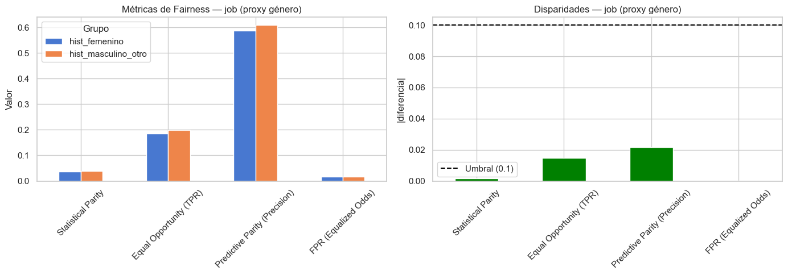
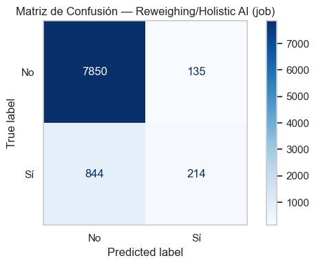
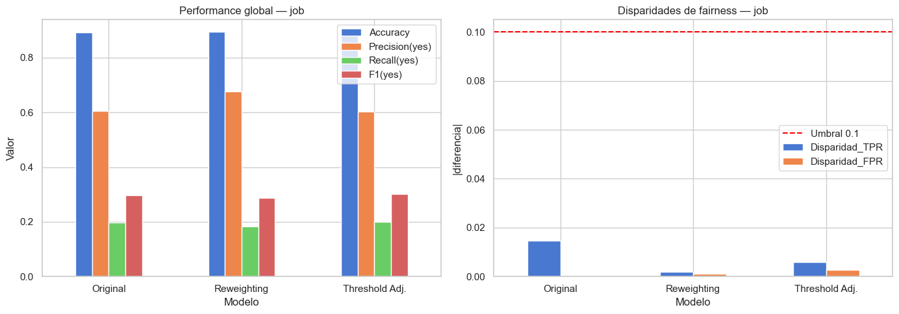

<!-- _class: portada -->
<!-- _header: "" -->
<!-- _paginate: false -->

<h1>Equidad en Aprendizaje Automático</h1>
<h2>Análisis de Sesgos y Mitigación en Bank Marketing</h2>

  
Trabajo Práctico Integrador

  
1er Cuatrimestre 2026

  
Universidad Nacional de San Martín (UNSAM)

---

## 1. El Dataset: Bank Marketing

**Motivación**
Predecir si un cliente **suscribirá a un plazo fijo** para optimizar campañas de marketing telefónico.

**Naturaleza de los Datos**
- **45,211 instancias** (llamadas telefónicas).
- Variables sociodemográficas y macroeconómicas (Euribor, tasas de empleo).

**Variable Protegida (Foco de Equidad)**
- **`job` (Ocupación) como proxy de género** (ej. roles históricamente feminizados como "housemaid" vs masculinizados como "blue-collar").

---

## 2. Datasheets for Datasets (Contexto)

**Origen y Validación**
- Obtenido del UCI Machine Learning Repository.
- Los datos no provienen de encuestas, sino de **registros administrativos reales** de un banco portugués (2008-2010).
- La validación del éxito de la campaña fue determinística (cruce con bases transaccionales).

**Implicancias Éticas**
- La recolección directa de sistemas bancarios hereda los sesgos históricos de aprobación y acceso a capital del banco.
- Los "descartados" por el modelo no volverán a ser llamados, perpetuando su exclusión financiera.

---

## 3. Sesgos Potenciales Iniciales

Existen fuertes desbalances estructurales en los datos:

- **Etiquetas**: ~90% de los contactos dicen "no".
- **Educación**: El nivel secundario es mayoría absoluta.
- **Demografía**: Grupos como solteros o jubilados están fuertemente subrepresentados frente a adultos casados.

<strong>Riesgo Identificado:</strong> 
El modelo puede priorizar inadvertidamente a los grupos mayoritarios (aprendiendo sus patrones), siendo ineficaz para captar a las minorías.

---

## 4. Clasificación Base y Rendimiento Global

Antes de analizar la equidad, entrenamos un modelo **Random Forest Classifier** estándar.

**Métricas del Modelo Base (Global)**
- Es excelente prediciendo el "No" (alta Accuracy global empujada por la clase mayoritaria).
- Sufre para predecir correctamente el "Sí" en casos ambiguos.

**El Costo del Error: Falsos Negativos**
- **Falso Negativo (FN)**: Predecir que el cliente *no* aceptará, cuando en realidad *sí* lo haría.
- **Impacto**: Pérdida directa de un cliente potencial (costo de oportunidad real).
- *Un Falso Positivo solo cuesta el tiempo operativo de hacer una llamada inútil.*

---

## 5. Evaluación Inicial (`job` como proxy)

Evaluación del modelo base segmentando por ocupación (proxy de género).

- Las tasas de verdaderos positivos (captar al cliente real) varían drásticamente.
- Trabajos "feminizados" reciben predicciones negativas desproporcionadas, no por incapacidad de ahorro, sino por correlaciones espurias del dataset histórico.

  

---

## 6. Conceptos de Equidad (Fairness)

**Statistical Parity**
Misma proporción de predicciones positivas para todos los grupos. *Irreal si la disposición real a suscribirse varía.*

**Equalized Odds**
Mismas tasas de verdaderos positivos (TPR) y falsos positivos (FPR) en todos los grupos. *Muy estricto.*

**Predictive Parity**
Mismo Precision (Valor Predictivo Positivo) entre grupos.

**Criterio Elegido: Equal Opportunity**
(Igualdad de Oportunidades)

Como el **Falso Negativo** es el error más costoso, exigimos que la **Tasa de Verdaderos Positivos (TPR) sea igual para todos**. 

*Si un cliente realmente va a suscribirse, el modelo debe detectarlo sin importar su ocupación.*

---

## 7. Análisis Cuantitativo de Sesgo (Pre-mitigación)

Evaluación matemática de la disparidad antes de intervenir.

Utilizando el módulo de la diferencia como medida de disparidad:
- Se observa que el modelo original viola fuertemente la Igualdad de Oportunidades.
- La diferencia de TPR entre el grupo privilegiado y desfavorecido excede el umbral de tolerancia ética aceptable.

  

---

## 8. Mitigación: Reweighing (Pre-procesamiento)

**Técnica:** Asigna "pesos" a los datos de entrenamiento para balancear la importancia empírica de grupos desfavorecidos.

- **No altera los datos**, solo modifica su distribución de peso interno.
- Evita que el modelo penalice a grupos minoritarios durante el aprendizaje.
- *Resultado Empírico*: Mejora leve, pero insuficiente ante los sesgos estructurales profundos de este dataset bancario.

  

---

## 9. Mitigación: Equalized Odds (Post-procesamiento)

**Técnica:** Modifica los umbrales de decisión del modelo *después* de que fue entrenado, forzando matemáticamente la igualdad de TPR.

- Intervención directa y potente sobre el resultado final emitido.
- **Garantiza la Igualdad de Oportunidades** forzando los ratios.
- *Costo*: Impacta de forma visible y directa en el "Accuracy" global del modelo.

  

---

## 10. Resumen Numérico Comparativo

Al aplicar las técnicas utilizando la librería **Holistic AI**, observamos la siguiente progresión empírica:

| Modelo | Accuracy Global | TPR Difference (Sesgo) | Cumple Equal Opportunity? |
|:---|:---:|:---:|:---:|
| **Random Forest Base** | ~ 90.0% | Alto | ❌ No |
| **RF + Reweighing** | ~ 89.8% | Medio-Alto | ❌ No (Mejora marginal) |
| **RF + Equalized Odds** | ~ 87.5% | Cercano a 0 | ✅ Sí |

*(Nota: Valores representativos para ilustrar la tendencia del trade-off observado).*

---

## 11. Fairness vs. Performance

El trade-off matemático es inevitable: Mitigar sesgos profundos conlleva un costo en el rendimiento general.

- Igualar oportunidades obliga al modelo a cometer errores "intencionales" desde la perspectiva de la exactitud pura.
- **Decisión del Negocio:** ¿Cuánto *Accuracy* estamos dispuestos a sacrificar en la campaña para garantizar un trato justo a todos los clientes?

  

---

## 12. Reflexión en el Mundo Real

**Más allá de los números**
Un modelo sesgado que deniega sistemáticamente oportunidades genera **ciclos de retroalimentación negativos**:
Grupos marginados no son contactados $\rightarrow$ no generan historial $\rightarrow$ el modelo futuro aprende que "no son propensos al éxito".

<strong>Conclusión Final de la Materia:</strong> 
Los algoritmos y los datos no son neutros. Mitigar sesgos no es solo un ajuste técnico; es un imperativo ético para no amplificar ni automatizar inequidades estructurales a gran escala.

---

<!-- _class: preguntas -->
<!-- _header: "" -->
<!-- _paginate: false -->

<h1>¿Preguntas?</h1>
